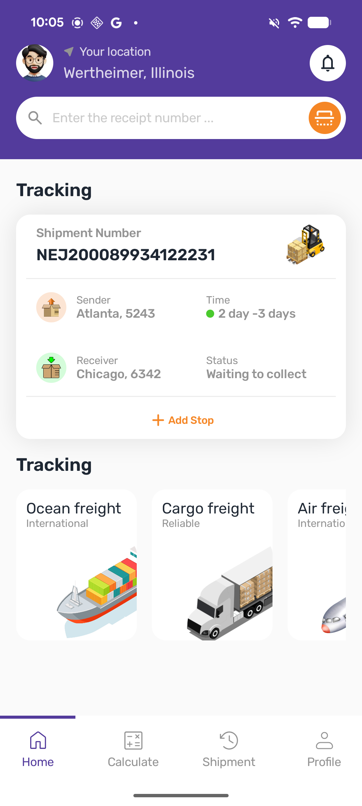
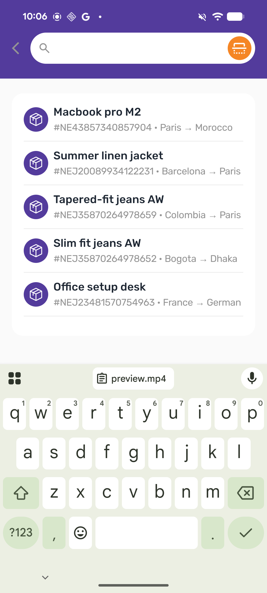
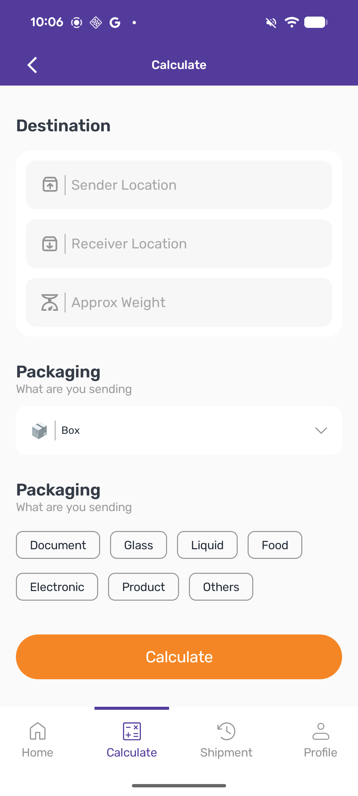
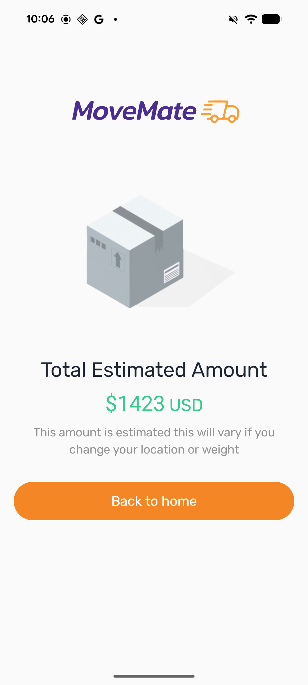
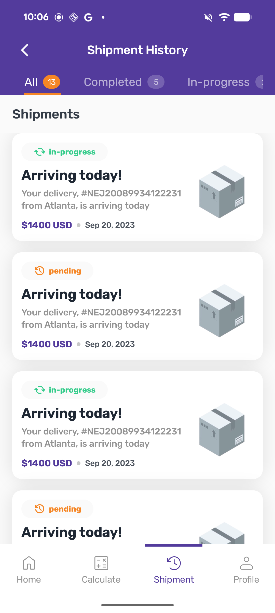

# Movemate App


Welcome to **Movemate**, an Android application developed by Tule Simon as an assessment for Moniepoint. Movemate is designed to provide a seamless experience for managing shipments, calculating logistics, and more.

## Table of Contents

-   [Introduction](#introduction)
-   [Features](#features)
-   [Preview](#preview)
-   [Tech Stack](#tech-stack)
-   [Architecture](#architecture)
-   [Project Structure](#project-structure)
-   [Responsiveness](#responsiveness)
-   [Animations](#animations)
-   [CI/CD](#ci/cd)
-   [Installation](#installation)
-   [Contact](#contact)

## Introduction

Movemate is a modern Android application built with Kotlin and Jetpack Compose, showcasing best practices in mobile development. It was developed as part of an assessment for Moniepoint, demonstrating proficiency in building scalable, maintainable, and user-friendly Android applications.

## Features

-   **Home Screen**: A welcoming dashboard for users.
-   **Calculate Module**: Functionality to calculate shipment costs or logistics.
-   **Shipment Management**: Tools for tracking and managing shipments.
-   **Custom Theming**: A unique and consistent user interface designed with custom Material 3 themes.
-   **Responsive UI**: Adapts seamlessly across various Android device sizes and orientations.
-   **Smooth Animations**: Enhanced user experience with fluid transitions and animations.

## Preview

Check out a quick video demonstration and some screenshots of the Movemate app in action!

### Video Preview

<video src="screenshots/preview.mp4" controls width="100%"></video>

### Screenshots

| Screenshot 1 | Screenshot 2 | Screenshot 3 |
|--------------|--------------|--------------|
|  |  |  |

| Screenshot 4 | Screenshot 5 |
|--------------|--------------|
|  |  |

## Tech Stack

The application leverages a robust set of modern Android technologies:

-   **Language**: Kotlin
-   **UI Toolkit**: Jetpack Compose
-   **Dependency Injection**: Hilt (Dagger Hilt)
-   **Asynchronous Operations**: Kotlin Coroutines & Flow
-   **Dependency Management**: Kotlin Conventional Plugin
-   **Styling**: Custom Material 3 Theming
-   **Font**: Rubik (for text sizing)

## Architecture

Movemate follows a clean, modular, and scalable architecture, adhering to best practices like **State Hoisting** for UI management.

### Key Architectural Principles:

-   **Modularity**: The application is divided into distinct, independent modules, promoting separation of concerns and reusability.
-   **Unidirectional Data Flow**: Data flows in a single direction, simplifying state management and debugging.
-   **Dependency Injection**: Hilt is used to manage dependencies, making the codebase more testable and maintainable.

## Project Structure

The project is organized into a multi-module architecture to promote reusability, maintainability, and scalability:

Movemate/
├── app/                  # The main application module, orchestrating features.
├── data/                 # Handles data sources, repositories, and data models.
├── core/                 # Contains shared components like:
│   ├── theme/            # Custom Material 3 themes, colors, typography, and responsiveness utils.
│   └── ...               # Other core utilities.
├── shared/               # Modules for sharing common logic and components across features.
│   ├── utils/            # General utility functions.
│   └── ...
└── features/             # Contains independent feature modules:
├── home/             # Home screen and related logic.
├── calculate/        # Shipment calculation feature.
├── shipment/         # Shipment tracking and management feature.
└── ...


## Responsiveness

A core aspect of Movemate's design is its adaptability to different screen sizes. A custom `ResponsivenessUtils` class, coupled with Compose's flexible layout system, ensures that the UI scales appropriately across various devices.

The `ResponsivenessUtils` class provides a mechanism to scale dimensions (like padding, spacing, and text sizes) based on the device's screen dimensions relative to a predefined base size. This ensures a consistent visual experience regardless of the screen real estate.

Here's the updated implementation of the `ResponsivenessUtils` class:

```kotlin
package com.movemate.core.theme.responsiveness

import androidx.compose.runtime.Composable
import androidx.compose.runtime.ReadOnlyComposable
import androidx.compose.runtime.compositionLocalOf
import androidx.compose.ui.unit.Dp
import androidx.compose.ui.unit.TextUnit
import androidx.compose.ui.unit.dp
import androidx.compose.ui.unit.sp

/**
 * Scaling class to scale sizes based on the screen width and height
 * @param screenWidth The width of the screen
 * @param screenHeight The height of the screen
 * @param baseWidth The base width to scale from
 * @param baseHeight The base height to scale from
 */
data class ResponsivenessUtils(
    val screenWidth: Float,
    val screenHeight: Float,
    val baseWidth: Int = 360,
    val baseHeight: Int = 800
) {
    /**
     * The short dimension of the screen
     */
    val shortDimension = minOf(screenWidth, screenHeight)

    /**
     * The long dimension of the screen
     */
    val longDimension = maxOf(screenWidth, screenHeight)

    /**
     * Scale a size based on the screen width (the short dimension)
     */
    fun scale(size: Float): Float {
        return (shortDimension / baseWidth) * size
    }

    /**
     * Scale a size based on the screen height (the long dimension)
     */
    fun verticalScale(size: Float): Float {
        return (longDimension / baseHeight) * size
    }

    /**
     * Scale a size based on the screen width (the short dimension) with a factor
     */
    fun moderateScale(size: Float, factor: Float = 0.5f): Float {
        return size + (scale(size) - size) * factor
    }

    /**
     * Scale a size based on the screen height (the long dimension) with a factor
     */
    fun moderateVerticalScale(size: Float, factor: Float = 0.5f): Float {
        return size + (verticalScale(size) - size) * factor
    }
}

val LocalScaling = compositionLocalOf<ResponsivenessUtils> {
    error("No Scaling provided")
}

/**
 * Scale a number to the current screen width
 */
val Number.w: Float
    @ReadOnlyComposable
    @Composable
    get() = LocalScaling.current.scale(this.toFloat())

/**
 * Scale a number to the current screen width and convert it to Dp
 */
val Number.wdp: Dp
    @ReadOnlyComposable
    @Composable
    get() = LocalScaling.current.scale(this.toFloat()).dp

/**
 * Scale a number to the current screen width and convert it to TextUnit
 */
val Number.wsp: TextUnit
    @ReadOnlyComposable
    @Composable
    get() = LocalScaling.current.scale(this.toFloat()).sp

/**
 * Scale a number to the current screen height
 */
val Number.h: Float
    @ReadOnlyComposable
    @Composable
    get() = LocalScaling.current.verticalScale(this.toFloat())

/**
 * Scale a number to the current screen height and convert it to Dp
 */
val Number.hdp: Dp
    @ReadOnlyComposable
    @Composable
    get() = LocalScaling.current.verticalScale(this.toFloat()).dp

/**
 * Scale a number to the current screen height and convert it to TextUnit
 */
val Number.hsp: TextUnit
    @ReadOnlyComposable
    @Composable
    get() = LocalScaling.current.verticalScale(this.toFloat()).sp

```
Animations
Movemate incorporates modern Jetpack Compose animation APIs to provide a delightful user experience:

Shared Element Transitions: For seamless visual continuity when navigating between screens, ensuring a smooth flow.

Animated Visibility: Used for animating the appearance and disappearance of UI elements, enhancing interactivity and feedback.

CI/CD
Movemate utilizes GitHub Actions for continuous integration and continuous delivery. This workflow automates the build process and generates APKs, ensuring consistent and reliable deployments.

Installation
To run Movemate on your local machine, follow these steps:

Clone the repository:
    git clone https://github.com/TuleSimon/Movemate.git

Contact
Feel free to connect with me for any questions or collaborations!

Name: Tule Simon

Role: Android Developer

GitHub: TuleSimon

LinkedIn: https://www.linkedin.com/in/tule-simon-67a202157

